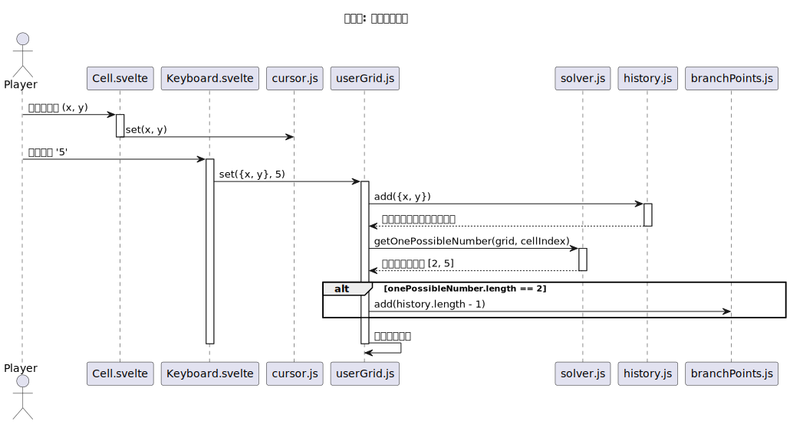

# 数独乐乐系统建模报告

## 引言

本报告将基于“数独乐乐”项目的功能需求和架构设计，提供一系列UML图来描述系统的行为和结构。

## 用例图

[用例图](./用例图.uxf "打开用例图")描述了系统外部用户（参与者）与系统之间交互的功能：

---

**用例描述**：

* **Actor**：
  * 玩家：与数独乐乐系统进行交互，能够实现输入数字、撤销、重做等操作，是该软件的行为的主要承担者；
  * 开发者：为数独乐乐软件集成新的算法策略并验证其正确性，维护软件的开发与维护，保障玩家用户的体验。
* **UseCase**：
  * **开始新游戏(startGame)**：玩家选择开始一个新的数独游戏；
  * **输入数字(enterNumber)**：玩家在数独棋盘的单元格中输入数字；
  * **撤销操作(undo)**：玩家撤销上一步操作；
  * **重做操作(redo)**：玩家重做之前撤销的操作；
  * **获得下一步提示(getHint)**：玩家请求系统给出下一步提示；
  * **导入SudokuWiKi题目(importPuzzles)**：玩家通过输入SudokuWiKi题目的URL来向软件导入题目；
  * **探索多种可能(exploreModeOn)**：玩家在面临多个可能答案时，可以进入探索模式，尝试不同的路径：
    * 包含**回溯到分支点(backtrackToBranch)**：在探索模式中，玩家可以回溯到之前做出选择的分支点 ；
    * 包含**采用策略(useStrategy)**：
      * 包含**显示采用策略**：在给出下一步策略的同时，系统会显示推理该答案所用的方法（策略）
      * 扩展策略：
        * **possibleNumber**：
          * 函数 `getPossibleNumber` 针对棋盘上每个空格，通过检查同行、同列和所属 3×3 宫内已经出现的数字，生成一个候选数字数组；
          * 对于已经填入数字的格子，其候选集合为空。
        * **nakedSingle**：
          * **原理**：如果某个格子的候选集合只有一个数字，则该数字就是必须填入的数；
          * **实现方式**：遍历所有候选数组，若某个候选数组长度为 1，则记录此格子和对应的唯一候选数字。
        * **hiddenSingle**:
          * **原理**：在某行、某列或某个 3×3 宫中，尽管某个格子的候选集合中可能有多个数字，但如果某个数字仅在整个单元内的某一个格子的候选集合中出现，则该格子必须填入这个数字。
          * **实现方式**：
            * 针对每个单元（行、列和盒子），枚举 1 到 9 的每个数字。
            * 对于当前数字，检查单元里每个格子的候选集合，记录该数字出现的格子索引。
            * 如果出现次数恰好为 1，并且该格子的候选集合长度大于 1（避免重复裸单情况），则记录为一个隐藏单元（`Hidden Single`）。
  * **集成新算法策略(addStrategy)**：开发者通过从SudokuWiKi等途径获取新的策略后导入集成到软件中。
  * **验证算法策略(validateStrategy)**：开发者需要检验将集成到软件中的算法的中却行，同时需要保障新旧算法之间的兼容性。

## 类图

用[类图](./类图.uxf)描述数独乐乐系统的类功能，刻画其静态组成结构（图片过大，详见[类图](./类图.uxf)）

---

**类描述：**

> 仅对关键组件类进行描述

1. **app**
   * **描述**：数独乐乐应用程序的主进入口和核心控制器。它协调各个组件，处理用户请求，管理游戏流程，并与用户界面、领域模型和外部服务进行交互。
   * **属性**：主要有以下四个抽象属性
     * **Board**：数独棋盘相关的组件，如数字键盘、操作栏等；
     * **Controls**：底部操作区有关的组件，如菜单、按钮等；
     * **Header**：顶部导航栏有关的组件，如不同类型的弹窗；
     * **Modal**：弹窗相关类型的组件。
   * **方法**：
     * 订阅gameWon变量，当游戏胜利时执行相应操作；
     * **onMount**：onMount钩子在组件首次挂载后执行，用于处理URL hash中的编码并弹出欢迎内容。
2. **Board**
   * **描述**：是对于app中Board抽象属性的功能展开。
   * **属性**：
     * **Candidates**：构建候选数字网络；
     * **Cell**：表示数独棋盘上的一个最小单元格。每个单元格有其行、列坐标、当前值、是否为初始固定数字以及可能的候选数字集合。
   * **方法**：这仍是一个抽象概念所以没有具体方法。
3. **Controls**
   * **描述**：是对app中Controls抽象属性的功能展开。
   * **属性**：
     * **ActionBar**：底层操作栏的容器组件
       * **Actions**：底层各项功能按钮逻辑，包括回溯、撤销、提示等操作；
       * **Timer**：计时功能，用于记录并展示游戏时长；
       * **Message**：消息展示区，用于在界面上提示或反馈操作信息。
     * **Keyboard**：提供屏幕数字键盘功能，让玩家直接点选输入数字。
   * **方法**：这仍是一个抽象概念所以没有具体方法。
4. **Header**
   * **描述**：是对app中Header抽象属性的功能展开。
   * **属性**：
     * **Button**：负责实现顶部的按钮功能，如分享、设置等；
     * **Dropdown**：用于实现游戏中的下拉菜单。
   * **方法**：这仍是一个抽象概念所以没有具体方法。
5. **Modal**
   * **描述**：是对app中Modal抽象属性的功能展开。
   * **属性**：share、QRcode、Settings、Confirm、Prompt、Welcome、GameOver等不同类型的弹窗组件。
   * **方法**：这仍是一个抽象概念所以没有具体方法。
6. **Candidates**
   * **描述**：对于Board中Candidates抽象属性的具体展开。
   * **属性**：
     * **candidates**：外部传来的候选数字集合；
     * **selected**：标识当前单元格是否被选中，用于回溯高亮显示。
   * **方法**：
     * **judgeRight**：判断当前候选号码是否为回溯中标记为正确的数字；
     * **judgeWrong**：判断当前候选号码是否为回溯中标记为错误的数字。
7. **Cell**
   * **描述**：对于Board中Cell抽象属性的具体展开。
   * **属性**：
     * **value**：当前单元格的值，若为空则为 undefined 或 0;
     * **cellX**：当前单元格在棋盘中的列坐标；
     * **cellY**：当前单元格在棋盘中的行坐标；
     * **candidates**：当前单元格的候选数字集；
     * **disable**：是否不可点击或被禁用；
     * **conflictingNumber**：当前单元格的数字是否与其他单元格冲突；
     * **userNumber**：标记该数字是否是用户填写的数字；
     * **selected**：当前单元格是否被选中（用于样式高亮；
     * **sameArea**：与选中单元格在同一区域（行/列/宫）中，用于辅助提示；
     * **sameNumber**：与选中数字相同，用于辅助提示。
   * **方法**：这是一个表示单元格状态的类，没有具体方法。
8. **Action**
   * **描述**：是对Controls\ActionBar中的Action抽象属性的具体实现。
   * **属性**：
     * **hintsAvailable**：计算剩余可用提示次数。
   * **方法**：
     * **handleHint**：使用提示--如果当前光标下有候选数字，则先清空，再应用系统自动填入的数字；
     * **handleLearn**：学习模式--通过 possibleNumberSolver 来获取一个可以确定的数字，并自动填入；
     * **handleBackTracking**：回溯功能--在检测到错误分支时，从存储的分支点处恢复并记录错误数字；
     * **handleUndo**：撤销操作--从 record 中拿到上一次的操作序列，逐一恢复；
     * **handleRedo**：重做操作--从 record 中读出当前可重做的操作序列，逐一应用。
9. **Keyboard**
   * **描述**：是对Controls中的Keyboard抽象属性的具体实现。
   * **属性**：
     * **keyboardDisabled**：决定是否禁用键盘。
   * **方法**：
     * **handleKeyButton**：处理按键按钮点击事件，根据传入的数字以及所处的状态执行相应的操作；
     * **handleKey**：处理全局键盘事件，根据按键值执行不同的操作。
10. **Buttons**
    * **描述**：是对Header中的Buttons抽象属性的具体实现。
    * **属性**：纯粹的方法类，没有明显属性。
    * **方法**：
      * **handleShareButton**：点击分享按钮时的处理函数；
      * **handleSettingsButton**：点击设置按钮时的处理函数。
11. **Dropdown**
    * **描述**：是对Header中的Dropdown抽象属性的具体实现。
    * **属性**：
      * **dropdownVisible**：标记下拉菜单是否处于显示状态。
    * **方法**：
      * **handleDifficulty**：处理点击某个难度选项的事件；
      * **handleCreateOwn**：处理“Create Own（自定义创建）”选项的点击事件。
12. **solver**
    * **描述**：定义了所有数独求解策略的公共接口。每个具体的策略类都需要实现这个接口，以提供获取提示或解决数独的方法。
    * **属性**：这是一个纯粹的方法类，没有具体的属性。
    * **方法**：

      * **nakedSingle**：利用裸单元法（naked single）找出每个候选数组中只有唯一候选数字的情况，将这些情况收集为一个 move 列表；
      * **hiddenSingle**：利用隐单法（hidden single）找出某一单位（行、列或盒）中唯一可填的数字，将这些情况加入到 move 列表中；
      * **getOnePossibleNumber**：根据给定的棋盘状态（二维数组），获取指定单元格（由 cellIndex 指定）的可能填入数字；
      * **getPossibleNumber**：计算整个数独棋盘中每个空白单元格的可能填入数字集合。
## 序列图
* 共有七个模块的序列图
    * **startGame**：玩家开始新游戏的流程；
    * **enterNumber**：玩家输入数字的流程；
    * **getHint**：玩家请求提示的流程；
    * **undo and redo**：玩家撤销操作与重做操作的流程；
    * **possibleNumber**：玩家请求可能数字的流程；
    * **backtracking**：玩家回溯到分支点的流程；
    * **importPuzzles**：玩家导入SudokuWiKi题目的流程；

---

### startGame

* **描述**:  
    展示了玩家在数独乐乐系统中开始新游戏的流程。玩家通过界面选择难度后，系统会初始化相关状态并生成新的棋盘。

* **参与者**:  
    * **Player**: 玩家，触发开始新游戏的操作。  
    * **Dropdown.svelte**: 负责显示难度选项的界面组件，接收玩家的选择并将难度传递给游戏逻辑控制器。  
    * **game.js**: 游戏逻辑控制器，负责处理新游戏的初始化，包括设置难度、生成棋盘以及重置相关状态。  
    * **stores**: 存储游戏状态的模块，包含游戏难度、棋盘数据、计时器、提示次数、操作记录、回溯分支点和历史记录等。

* **流程**:  
    1. 玩家点击界面上的 "New Game" 按钮，触发显示难度选项。  
    2. `Dropdown.svelte` 组件负责显示难度选项（如 very easy、easy、medium、hard）。  
    3. 玩家选择难度（如 easy）。  
    4. `Dropdown.svelte` 调用 `startNew('easy')` 方法，将玩家选择的难度传递给游戏逻辑控制器。  
    5. `game.js` 接收到难度参数后，执行以下操作以初始化新游戏：  
         * 调用 `difficulty.set('easy')` 方法，将游戏难度存储到 `stores` 中。  
         * 调用 `grid.generate('easy')` 方法，根据选择的难度生成新的数独棋盘。  
         * 调用 `timer.reset()` 方法，重置计时器以记录新游戏的时间。  
         * 调用 `hints.reset()` 方法，重置提示次数，确保玩家从初始状态开始游戏。  
         * 调用 `record.reset()` 方法，清空操作记录，为玩家提供干净的操作历史。  
         * 调用 `branchPoints.reset()` 方法，清空回溯分支点，确保探索模式的分支点从零开始。  
         * 调用 `history.reset()` 方法，清空历史记录，确保撤销和重做功能从初始状态开始。

* **结果**:  
    系统完成初始化后，玩家可以开始新的数独游戏。此时，界面显示新的棋盘，计时器开始计时，玩家可以根据选择的难度进行游戏。

* **关键点**:  
    * `Dropdown.svelte` 的作用是提供交互界面，接收玩家的输入并将其传递给逻辑控制器。  
    * `game.js` 是核心逻辑控制器，负责协调所有模块的初始化工作。  
    * `stores` 是状态管理模块，确保游戏的所有状态（如难度、棋盘数据、计时器等）能够被正确存储和更新。

### enterNumber

* **描述：**
  展示了玩家在数独棋盘上选择单元格并输入数字的完整交互流程。该流程不仅包含了更新棋盘状态的基础操作，还集成了历史记录（用于撤销）和分支点（用于回溯）的智能处理逻辑。系统会自动识别玩家在“二选一”格子上做出的决策，并将其标记为关键的回溯点。

* **参与者**:
  * **Player**：玩家，是所有操作的发起者。
  * **Cell.svelte**：单元格组件，负责接收玩家的点击事件并更新光标位置。
  * **Keyboard.svelte**：数字键盘组件，负责接收玩家的数字输入请求。
  * **userGrid.js**：核心状态管理器，负责处理棋盘数据的更新、记录历史以及判断是否为分支点。
  * **stores (cursor, history, branchPoints)**：多个原子化的状态存储单元，分别管理光标、操作历史和回溯点，实现了关注点分离。
  * **solver.js**：数独求解器，提供计算指定单元格所有候选数的算法能力。

* **流程：**
  1.  **选择单元格**: 玩家点击棋盘上的一个空白单元格。`Cell.svelte` 组件捕获此事件，并调用 `cursor.set()` 来更新全局的光标状态。
  2.  **输入数字**: 玩家点击屏幕键盘上的数字（例如‘5’）。`Keyboard.svelte` 随即调用 `userGrid` store 的 `set(position, value)` 方法。
  3.  **记录历史与判断分支点**: `userGrid.set` 方法的内部逻辑按以下顺序执行：
      * 首先，调用 `history.add()` 将当前操作的坐标记录到历史堆栈中，为“撤销”功能做准备。
      * 接着，调用 `solver.getOnePossibleNumber()`，在**正式填入数字前**，计算当前单元格的所有候选数字。
      * **执行关键判断**：检查返回的候选数数组长度是否等于 2。如果是，说明这是一个“二选一”的关键决策，系统会调用 `branchPoints.add()` 将此步骤的索引记录为一个可供快速回溯的**分支点**。
      * 最后，更新内部的棋盘数组，将数字‘5’填入，并通过 Svelte 的响应式机制更新 UI。
* **结果：**
玩家选择的单元格在界面上显示出新填入的数字。该操作被成功记录，并且如果符合条件，会被智能地标记为一个回溯点，增强了游戏的探索性和容错性。

* **关键点：**
  * **状态与视图分离**: `userGrid.js` 作为状态逻辑的核心，与 `Cell` 和 `Keyboard` 等视图组件完全解耦，体现了良好的分层设计。
  * **意图驱动的逻辑**: 系统不是简单地记录每一次填数，而是通过 `getOnePossibleNumber` 理解了操作的“上下文”，从而实现了**智能分支点**的创建，这是提升回溯功能用户体验的核心设计。
  * **原子化状态管理**: 整个流程涉及到 `userGrid`, `cursor`, `history`, `branchPoints` 等多个独立的 store，每个 store 只负责一项单一的职责，使得状态管理清晰、可维护且易于测试。

### getHint

* **描述：**
该序列图展示了玩家请求系统提示（或使用“学习模式”）时的内部工作流程。此功能的核心是为玩家提供一个逻辑上可以推导出的下一步解法，**而不仅仅是揭示一个随机答案**。系统会依次应用不同的解题策略（如“裸单元法”、“隐单元法”），找到一个确定的步骤，并将其应用到棋盘上，同时消耗一次提示机会。

* **参与者：**
  * **Player**：玩家，通过点击界面按钮发起提示请求。
  * **Actions.svelte**：UI组件，包含了“提示”或“学习”按钮，是用户交互的入口。
  * **solver.js**：核心求解器模块，封装了多种数独解题策略算法，负责计算出下一步可行的解法。
  * **userGrid.js**：棋盘状态管理器，提供当前的棋盘数据供求解器分析，并在最后接收更新。
  * **hints.js**：提示次数管理器，负责记录和更新剩余的提示次数。

* **流程：**
  1.  **发起请求**: 玩家点击界面上的“提示”或“学习”按钮，触发 `Actions.svelte` 组件中的相应处理函数。
  2.  **调用求解器**: `Actions.svelte` 首先从 `userGrid` store 中获取当前的棋盘布局，然后将其作为参数传递给 `solver.js` 中的 `possibleNumberSolver()` 函数。
  3.  **策略执行**: `possibleNumberSolver` 函数内部按预设的优先级执行解题策略：
      * 它首先计算整个棋盘所有空格的候选数 (`getPossibleNumber`)。
      * 然后，它尝试使用 `nakedSingle`（裸单元）策略寻找只有一个候选数的单元格。
      * 如果 `nakedSingle` 未找到解，它会继续尝试 `hiddenSingle`（隐单元）等更复杂的策略。
  4.  **返回结果**: 一旦找到一个确定的解法，`solver.js` 会返回一个包含位置、数值和所用策略名称的对象（例如 `{ idx: 74, value: 6 }, 'nakedSingle'`）给 `Actions.svelte`。
  5.  **更新状态**: `Actions.svelte` 接收到解法后，执行两个关键更新：
      * 调用 `hints.useHint()` 方法，将剩余提示次数减一。
      * 调用 `userGrid.set()` 方法，将求解器返回的数字填入棋盘的对应位置。

* **结果**:
棋盘上一个逻辑上最简单的空格被自动填上正确的数字。玩家的剩余提示次数减一，并且通过界面可以看到此次提示所依据的解题策略（例如“裸单元法”），从而达到了学习和辅助的目的。

* **关键点：**
  * **策略模式的应用**: `solver.js` 采用策略模式，将不同的解题算法解耦，使得系统易于扩展，未来可以方便地加入更多高级算法。
  * **非破坏性计算**: 求解器首先在不修改原棋盘的情况下进行分析和计算，只有在找到确定性解法后，才将结果返回给上层进行状态更新，保证了数据流的清晰和单向性。
  * **教学导向的设计**: 该功能不仅给出了答案，更重要的是通过返回策略名称，向玩家揭示了背后的逻辑，符合项目“对初学者友好”的核心目标。

### undo and redo

* **描述：**
该序列图展示了系统如何实现可撤销的操作，为玩家提供了标准的撤销（Undo）和重做（Redo）功能。该机制采用了经典的**命令模式（Command Pattern）**，将每一次对棋盘的操作封装成一个独立的对象，并利用两个堆栈（`undoStack` 和 `redoStack`）来管理操作历史，从而实现对棋盘状态的精确回退与重现。

* **参与者：**
  * **Player**：玩家，通过填入数字创建操作历史，或通过点击按钮发起撤销/重做请求。
  * **Actions.svelte**：UI 交互层，包含“撤销”和“重做”按钮，负责调用底层的 `record` 模块。
  * **record.js**：核心历史管理器，实现了 undo/redo 的所有逻辑，包括维护两个堆栈和更新按钮状态。
  * **userGrid.js**：棋盘状态管理器，是命令模式中被操作的“接收者”（Receiver），其状态会根据撤销或重做的命令被改变。

* **流程：**
  1.  **记录操作 (Do Action)**:
      * 当玩家在棋盘上执行一个操作（如填入数字）时，`userGrid.js` 不仅会更新自身状态，还会调用 `record.do(action)`。
      * `record.do` 将代表该操作的对象（包含新旧值等信息）压入 `undoStack` 中。
      * **关键逻辑**：一旦有新操作发生，`redoStack` 会被立即清空，这意味着在撤销之后如果执行了新操作，就不能再“重做”之前的步骤了。这在 `undoRedo.test.js` 中有明确的测试用例。
  2.  **执行撤销 (Undo)**:
      * 玩家点击“撤销”按钮，`Actions.svelte` 调用 `record.undo()`。
      * `record.undo()` 从 `undoStack` 中弹出一个操作，并将其压入 `redoStack` 中，然后将该操作对象返回。
      * `Actions.svelte` 组件接收到返回的操作对象，并据此调用 `userGrid.set()` 来恢复棋盘到操作前的状态（使用 `oldValue`）。
  3.  **执行重做 (Redo)**:
      * 玩家点击“重做”按钮，`Actions.svelte` 调用 `record.redo()`。
      * `record.redo()` 从 `redoStack` 中弹出一个操作，并将其重新压入 `undoStack` 中，然后返回该操作。
      * `Actions.svelte` 组件接收到返回的操作对象，并据此调用 `userGrid.set()` 来恢复棋盘到操作后的状态（使用 `newValue`）。

* **结果**:
玩家可以自由地在自己的操作历史中前进和后退。UI 上的“撤销”和“重做”按钮会根据 `record.js` 中 `canUndo` 和 `canRedo` 这两个响应式状态自动启用或禁用，为用户提供了清晰、可靠的交互反馈。

* **关键点**：
  * **命令模式的实现**: 将每个操作封装成包含上下文（新旧值、位置）的对象，使得操作本身可以被存储、传递和反向执行。
  * **双堆栈机制**: 这是实现 Undo/Redo 功能最标准、最高效的设计模式，逻辑清晰且易于管理。
  * **状态与视图的解耦**: `record.js` 模块独立维护了操作历史和可用状态（`canUndo`, `canRedo`），UI 组件 (`Actions.svelte`) 只负责响应用户输入和订阅这些状态，而不需要了解其内部实现，实现了逻辑和视图的清晰分离。

### possibleNumber

* **描述：**
这是一个辅助功能，旨在帮助玩家分析棋盘局势。系统会根据当前棋盘上已有的数字，为每一个空格计算出所有符合数独规则的候选数字，并将这些数字动态地显示在界面上。

* **参与者：**
  * **Player**：玩家，通过点击开关来激活或关闭此功能。
  * **PossibleNumberSwitch.svelte** (推断的UI组件)：玩家直接与之交互的开关按钮。
  * **possibleNumbers.js**：功能核心的状态管理器，负责维护候选数的显示状态（开/关）以及存储计算出的候选数数据。
  * **solver.js**：数独求解器，提供底层的计算能力，负责执行候选数的推算逻辑。
  * **userGrid.js**：棋盘状态管理器，为计算过程提供当前的、最准确的棋盘数据。
  * **Cell.svelte** (推断的UI组件)：单元格组件，负责订阅 `possibleNumbers.js` 的状态，并最终在界面上渲染出候选数字。

* **流程：**
  1.  **激活功能**：玩家点击“显示候选数”的开关按钮。UI组件调用 `possibleNumbers.js` store 中的 `toggle()` 方法。
  2.  **触发计算**：`possibleNumbers.js` store 在其状态变为“激活”后，会立即执行 `fresh(grid)` 方法。此方法首先从 `userGrid.js` 获取当前的棋盘布局。
  3.  **调用求解器**：`fresh(grid)` 方法将当前棋盘数据传递给 `solver.js` 中的 `getPossibleNumber(grid)` 函数。
  4.  **执行计算**：`solver.js` 模块遍历棋盘上的每一个空格。对于每个空格，它会检查其所在的行、列和九宫格，排除掉所有已经出现的数字，从而得出一个包含所有可能填入数字的数组。
  5.  **更新状态**：`solver.js` 将计算结果（一个包含81个元素的数组，每个元素又是一个候选数数组）返回给 `possibleNumbers.js`。store 接收到数据后，会将其格式化并更新到自身的响应式变量中。
  6.  **渲染视图**：由于 `Cell.svelte` 组件订阅了 `possibleNumbers` store，当 store 的数据更新时，Svelte 的响应式系统会自动触发相关单元格的UI更新，从而在界面上以小字体的形式显示出所有候选数字。

* **结果**：
玩家激活功能后，棋盘上所有空白单元格内都会清晰地展示出当前所有可能的候选数字。当玩家再次点击开关关闭此功能时，这些候选数字会从界面上消失。

* **关键点**：
  * **逻辑与视图分离**：计算候选数的复杂逻辑被完全封装在 `solver.js` 中，而状态管理和UI更新则分别由 `possibleNumbers.js` 和 Svelte 组件负责，职责清晰。
  * **响应式数据流**：整个流程充分利用了 Svelte 的响应式特性。数据（候选数）的计算和更新是单向流动的，UI 的渲染是这一数据流的自然结果，无需手动操作 DOM。
  * **按需计算**：候选数的计算只在玩家明确需要时（即激活开关时）才触发，避免了在玩家每次填数时都进行不必要的全局计算，优化了性能。

### backtracking

* **描述：**
该序列图详细阐述了数独乐乐中的智能回溯功能。与传统的单步撤销不同，回溯功能允许玩家在发现解题路径进入死胡同后，能够一键返回到最近的一个**关键决策点**（即分支点）。系统通过自动识别并记录玩家在“二选一”单元格中做出的选择来创建这些分支点，从而极大地提升了探索和纠错的效率。

* **参与者：**
  * **Player**：玩家，在意识到当前路径错误后，主动点击“回溯”按钮。
  * **Actions.svelte**：用户界面的交互层，负责接收玩家的回溯请求并协调相关模块完成操作。
  * **branchPoints.js**：分支点管理器，存储了所有关键决策点在历史记录中的索引位置。
  * **history.js**：操作历史记录器，按时间顺序保存了玩家的每一步操作，是回溯功能的基础。
  * **userGrid.js**：棋盘状态管理器，在回溯过程中，其状态（即棋盘上的数字）会被恢复到分支点时的状态。
  * **wrongNumber.js**：错误计数器，用于记录玩家的回溯次数，作为游戏统计的一部分。

* **流程：**
  1.  **触发回溯**：玩家点击“回溯”(`Backtrack`)按钮，调用 `Actions.svelte` 中的处理函数。
  2.  **定位分支点**：`Actions.svelte` 从 `branchPoints` store 中获取最后一次记录的分支点索引 (`lastBranchStep`)。这个索引指向 `history` store 中的一个特定步骤。
  3.  **确定回溯范围**：`Actions` 组件根据获取到的索引，从 `history` store 中筛选出从该分支点之后发生的所有操作。
  4.  **执行回滚**：
      * `Actions` 组件遍历这些需要撤销的操作，并调用 `userGrid.set()` 将对应单元格的值恢复为 0（即清空）。
      * 同时，调用 `history.remove()` 将这些错误的操作从历史记录中移除。
  5.  **清理状态**：
      * 回滚完成后，调用 `branchPoints.remove()` 将刚刚使用过的这个分支点从堆栈中移除，因为它已经被消费掉了。
      * 调用 `wrongNumber` store 的更新方法，将错误猜测的次数加一，用于统计。

* **结果：**
玩家的棋盘瞬间恢复到最近一个关键决策点的状态，所有在该决策点之后进行的错误操作都被清空。玩家可以从这个分支点开始，尝试另一种解题路径，而无需手动一步步撤销。

* **关键点：**
  * **自动化分支点创建**：此功能的核心优势在于其分支点是**自动创建**的。当系统检测到玩家在一个仅有两种候选数字的单元格中填入数字时，会自动将该步骤标记为分支点，无需用户手动保存。
  * **高效的错误修正**：相比于多次使用“撤销”，回溯功能提供了一步到位的解决方案，极大地减少了玩家修正深度错误时的操作负担。
  * **鼓励探索式玩法**：由于可以无成本地回退到关键节点，玩家可以更大胆地进行尝试和猜测，增强了游戏的探索性和趣味性。
  * **数据驱动的健壮性**：整个回溯过程由 `branchPoints` 和 `history` 这两个 store 精确驱动，保证了状态恢复的准确性和一致性。

### importPuzzles

* **描述：**
该序列图展示了玩家通过粘贴 URL 来导入外部数独题目的功能流程。此功能旨在增强应用的开放性和题库的丰富性，允许用户无缝接入来自 SudokuWiki.org 等主流平台的谜题。整个流程包含了对 URL 的严格校验、数据解析、错误处理以及成功导入后的状态重置，确保了导入过程的健壮性和良好的用户反馈。

* **参与者：**
  * **Player**：玩家，负责提供包含数独数据的 URL。
  * **Prompt.svelte** (或类似模态框)：提供一个输入框，让玩家可以粘贴 URL 并确认导入。
  * **game.js**：核心的游戏逻辑控制器，负责接收 URL，并调度解析、验证和加载功能。
  * **message.js**：消息通知模块，当导入失败时，负责向用户显示错误提示。
  * **grid.js** (及其他 stores)：棋盘状态管理器，在成功解析后负责接收新的棋盘数据，并与其他 store 一起被重置。

* **流程：**
  1.  **用户输入**: 玩家在弹出的提示框中粘贴一个包含数独数据的 URL，并点击确认。
  2.  **调用导入函数**: UI 组件调用 `game.js` 中的 `startByImport(url)` 方法，启动导入流程。
  3.  **解析与验证**:
      * `startByImport` 函数首先调用其内部的 `parseSudokuFromUrl(url)` 方法进行解析。
      * 该方法会严格验证 URL 的 `bd` (board data) 查询参数，确保其存在且是由 81 个数字组成的字符串。
  4.  **处理结果**:
      * **如果验证失败**：`parseSudokuFromUrl` 会抛出一个错误。`startByImport` 函数会捕获这个错误，并调用 `message.set("导入失败")`，通过 `message.js` store 向用户显示一条清晰的错误提示，然后终止流程。
      * **如果验证成功**：解析函数会将 81 位的字符串转换为一个 9x9 的二维数组（即棋盘数据）。
  5.  **加载新游戏**: `startByImport` 接收到成功的棋盘数据后，会像开始新游戏一样，调用 `grid.set(board)` 来更新棋盘，并随后调用一系列 `reset()` 方法，清空计时器、历史记录、分支点等所有旧的游戏状态。

* **结果：**
如果 URL 有效，一个新的数独谜题会成功加载到屏幕上，同时所有相关的游戏状态都被重置，玩家可以立即开始解题。如果 URL 无效，玩家会收到一条明确的“导入失败”的提示信息，应用状态保持不变。

* **关键点：**
  * **健壮的错误处理**: 该功能的核心在于其强大的验证和错误处理机制。它不会因为无效的输入而崩溃，而是通过向用户提供明确的反馈来优雅地处理失败情况，这在 `importSudoku.test.js` 中有详细的测试用例支持。
  * **代码复用**: 成功的导入流程复用了与 `startNew` 函数相同的状态重置逻辑，这体现了良好的代码组织和模块化设计，避免了代码冗余。
  * **提升用户体验**: 该功能极大地扩展了用户获取题目的方式，通过一个简单的复制粘贴操作，就能玩到来自网络的高质量数独谜题，降低了使用门槛。

## 状态图

---

### **系统概述**
本状态图描绘了“数独乐乐”应用从启动到游戏结束的完整生命周期。整个应用被建模为一个清晰的状态机，其核心围绕着两大主要状态：**`Initializing` (初始化中)** 和 **`Gaming` (游戏中)**。系统通过明确的状态转换来响应用户交互和内部逻辑事件，确保了流程的健壮性和可预测性。

### **状态分解**

1.  **`Initializing` (初始化中)**
    * **描述**: 这是应用的入口状态，负责处理新会话的所有准备工作。它的核心任务是决定游戏的初始棋盘布局。
    * **子流程**:
        * **`CheckingURL`**: 应用启动后的第一个微状态。它会检查当前页面的 URL 是否包含有效的数独谜题数据 (`sencode`)。
        * **`LoadingFromURL`**: 如果 URL 中存在有效数据，系统会进入此状态，调用 `grid.decodeSencode(data)` 方法来解析数据并设置棋盘，随后直接进入 `Gaming` 状态。
        * **`Welcome`**: 如果 URL 中没有谜题数据，系统会展示欢迎界面。在此界面，玩家有两个选择：
            1.  通过 `startNew(difficulty)` 选择一个标准难度，直接进入 `Gaming` 状态。
            2.  通过 `show('prompt')` 打开一个输入框 (`CustomInput` 状态)，让玩家可以粘贴自己的谜题编码。
        * **`CustomInput`**: 这是一个临时的输入状态，接收到玩家的自定义编码后，会调用 `startCustom(sencode)`，然后进入 `Gaming` 状态。

2.  **`Gaming` (游戏中)**
    * **描述**: 这是应用的核心交互状态，玩家在此进行游戏。它内含一个名为 `Active` 的复合状态，以及多个由 `Active` 派生出的瞬时或临时状态。
    * **`Active` Sub-state**: 这是玩家进行操作的主要状态。
        * **`NumberMode` vs. `NoteMode`**: `Active` 状态内部还有一个重要的子状态切换。默认是 `NumberMode`，用于直接输入数字。通过调用 `notes.toggle()`，玩家可以在此模式和 `NoteMode`（用于填写候选数）之间来回切换。
        * **内部动作**: 在 `Active` 状态下，系统会响应一系列用户操作，如 `handleKey` (键盘输入), `handleHint` (提示), `handleUndo` (撤销) 等。这些动作会改变底层数据，但通常不会改变 `Active` 状态本身。
    * **`Paused` Sub-state**: 当玩家调用 `pauseGame()` 时，系统会从 `Active` 进入 `Paused` 状态，此时计时器会停止。调用 `resumeGame()` 则会返回 `Active` 状态。

3.  **模态框与终结状态**
    * **`Settings`, `Share`, `ConfirmNewGame`**: 这些都是从 `Gaming` 状态派生出的临时**模态状态**。它们会覆盖在主游戏界面之上，让用户进行特定操作（如修改设置）。操作完成后，通过 `hide()` 方法返回到 `Gaming` 状态。特别地，`ConfirmNewGame` 在确认后会通过 `startNew()` 直接转换到 `Initializing` 状态，开始一个全新的游戏会话。
    * **`GameWon`**: 这是一个**自动检测**的终端状态。当 `userGrid` store 的数据发生变化时，系统会检查棋盘是否已填满且无误。一旦满足条件，`gameWon` 状态变为 true，系统从 `Active` 自动转换到 `GameWon`。
    * **`GameOver`**: `GameWon` 状态会触发 `show('gameover')`，显示游戏结束的庆祝模态框。在这个界面上，玩家可以选择开始新游戏（回到 `Initializing` 状态）或者关闭模态框（理论上会返回 `Gaming` 状态，但此时棋盘已满，通常玩家会选择前者）。

### **关键转换与逻辑**
* **响应式状态转换**: 该状态机最显著的特点是大量使用了 Svelte 的响应式 store。例如，`Active` 到 `GameWon` 的转换不是由一个直接的函数调用触发的，而是由 `gameWon` 这个派生 store (`derived store`) 自动完成的。这体现了现代前端框架中数据驱动状态转换的设计思想。
* **状态隔离与协调**: `Gaming` 状态与 `Settings`、`Share` 等模态状态是隔离的。`Gaming` 状态可以在后台保持，而 `Settings` 等模态框作为临时状态存在于上层。这种设计使得功能的添加和修改（例如增加一个新的模态框）不会轻易影响到核心的游戏逻辑。
* **循环与重置**: 该状态图清晰地展示了应用的两个主要循环路径：
    1.  `Initializing` -> `Gaming` -> `GameWon` -> `GameOver` -> `Initializing`: 一个完整的游戏成功流程。
    2.  `Gaming` -> `ConfirmNewGame` -> `Initializing`: 玩家在游戏中途选择重新开始。
    这两个循环都最终指向 `Initializing` 状态，并通过 `startNew()` 或 `startCustom()` 等函数确保了每次新游戏的开始都是一个干净、无副作用的全新环境。