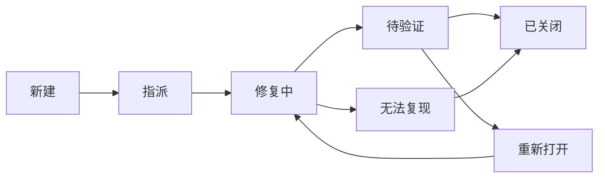

# 数独乐乐软件测试与质量保证报告

## 1. 项目概述

### 1.1 项目名称
数独乐乐 (Sudoku Game)

### 1.2 项目简介
数独乐乐是一个基于Web的数独游戏平台，采用Svelte框架开发，提供完整的数独游戏体验，包括求解算法、回溯功能、撤销重做、题目导入等功能。

### 1.3 技术栈
- **前端框架**: Svelte 3
- **样式框架**: Tailwind CSS
- **构建工具**: Rollup
- **测试框架**: Jest
- **测试工具**: @testing-library/svelte, jsdom
- **包管理**: npm

## 2. 测试策略与计划

### 2.1 测试目标
1. 确保数独游戏核心功能的正确性和稳定性
2. 验证数独求解算法的准确性和性能
3. 保证用户界面的交互体验
4. 确保代码质量和可维护性
5. 验证跨浏览器兼容性

### 2.2 测试范围
- **功能测试**: 核心游戏逻辑、求解算法、用户交互
- **单元测试**: 模块级别的功能验证
- **集成测试**: 组件间的交互验证
- **性能测试**: 算法性能和响应时间
- **兼容性测试**: 跨浏览器和设备兼容性
- **用户体验测试**: 界面易用性和交互流畅性

### 2.3 测试环境
- **开发环境**: Node.js + Jest + jsdom
- **浏览器环境**: Chrome, Firefox, Safari, Edge
- **设备支持**: 桌面端 + 移动端响应式设计

### 2.4 质量标准
根据jest.config.js配置，项目设定的代码覆盖率标准为：
- **分支覆盖率**: ≥70%
- **函数覆盖率**: ≥70%
- **行覆盖率**: ≥70%
- **语句覆盖率**: ≥70%

## 3. 测试用例设计

### 3.1 单元测试

#### 3.1.1 回溯算法测试 (backtracking.test.js)

**测试模块**: `@sudoku/stores/branchPoints`

**测试目标**: 验证回溯算法的分支点管理、历史记录和统计功能

**已实现测试用例**:

| 测试用例ID | 测试描述 | 期望结果 | 状态 |
|-----------|----------|----------|------|
| BT-001 | 正确添加分支点 | 分支点数组包含正确的索引值 | ✅ 已实现 |
| BT-002 | 正确删除分支点 | 指定分支点被移除，其他保留 | ✅ 已实现 |
| BT-003 | 记录正确和错误猜测次数 | 计数器正确递增 | ✅ 已实现 |
| BT-004 | 重置功能清除所有状态 | 所有分支点和计数器归零 | ✅ 已实现 |
| BT-005 | 模拟回溯算法解决数独 | 正确处理回溯和重新尝试逻辑 | ✅ 已实现 |
| BT-006 | 复杂数独中的回溯性能 | 处理多步回溯场景 | ✅ 已实现 |

**关键测试代码示例**:
```javascript
test('应该能正确添加分支点', () => {
  branchPoints.add(0);
  branchPoints.add(1);
  
  let points = get(branchPoints);
  expect(points).toHaveLength(2);
  expect(points).toContain(0);
  expect(points).toContain(1);
});
```

#### 3.1.2 可能数字求解测试 (possibleNumber.test.js)

**测试模块**: `@sudoku/solver`

**测试目标**: 验证数独候选数计算的准确性

**已实现测试用例**:

| 测试用例ID | 测试描述 | 期望结果 | 状态 |
|-----------|----------|----------|------|
| PN-001 | 返回正确的可能数字 | 空格返回正确候选数，已填格返回空数组 | ✅ 已实现 |
| PN-002 | 处理已完全填充的行/列/宫 | 返回空数组 | ✅ 已实现 |
| PN-003 | 为整个网格返回可能数字 | 返回长度为81的数组 | ✅ 已实现 |

**关键测试数据**:
```javascript
const sudokuGrid = [
  [5, 3, 0, 0, 7, 0, 0, 0, 0],
  [6, 0, 0, 1, 9, 5, 0, 0, 0],
  // ... 更多行
];

const possibleForEmptyCell = getOnePossibleNumber(sudokuGrid, cellIndex);
expect(possibleForEmptyCell).toEqual([1, 2, 4]);
```

#### 3.1.3 数独导入功能测试 (importSudoku.test.js)

**测试模块**: `@sudoku/game`

**测试目标**: 验证从SudokuWiki URL导入数独题目的功能

**已实现测试用例**:

| 测试用例ID | 测试描述 | 期望结果 | 状态 |
|-----------|----------|----------|------|
| IS-001 | 正确解析SudokuWiki URL | 返回正确的9x9数独数组 | ✅ 已实现 |
| IS-002 | 处理不包含bd参数的URL | 抛出相应错误 | ✅ 已实现 |
| IS-003 | 处理不完整bd参数的URL | 抛出相应错误 | ✅ 已实现 |
| IS-004 | 处理包含无效字符的bd参数 | 抛出相应错误 | ✅ 已实现 |
| IS-005 | 处理其他格式的URL | 正确解析含bd参数的URL | ✅ 已实现 |
| IS-006 | 处理全零数独 | 返回全零的9x9数组 | ✅ 已实现 |

**测试URL示例**:
```javascript
const wikiUrl = "https://www.sudokuwiki.org/sudoku.htm?bd=300967001040302080020000070070000090000873000500010003004705100905000207800621004";
const result = parseSudokuFromUrl(wikiUrl);
expect(result).toEqual(expectedSudokuArray);
```

#### 3.1.4 撤销重做功能测试 (undoRedo.test.js)

**测试模块**: `@sudoku/stores/record`

**测试目标**: 验证撤销重做机制的正确性

**已实现测试用例**:

| 测试用例ID | 测试描述 | 期望结果 | 状态 |
|-----------|----------|----------|------|
| UR-001 | 记录状态变化 | canUndo为true，canRedo为false | ✅ 已实现 |
| UR-002 | 撤销操作 | 正确返回上一状态，更新canUndo/canRedo | ✅ 已实现 |
| UR-003 | 重做撤销的操作 | 正确恢复状态 | ✅ 已实现 |
| UR-004 | 多步撤销和重做 | 按正确顺序处理多步操作 | ✅ 已实现 |
| UR-005 | 新操作后重置重做堆栈 | canRedo变为false | ✅ 已实现 |
| UR-006 | update方法更新状态 | 正确更新并记录历史 | ✅ 已实现 |
| UR-007 | reset方法清空历史 | 清除所有历史记录 | ✅ 已实现 |

### 3.2 集成测试计划

#### 3.2.1 组件集成测试

**需要补充的测试用例**:

| 测试用例ID | 测试描述 | 测试组件 | 优先级 |
|-----------|----------|----------|--------|
| IT-001 | 数独棋盘与候选数显示集成 | Board + Candidates | 高 |
| IT-002 | 数字输入与状态更新集成 | Keyboard + UserGrid | 高 |
| IT-003 | 提示功能与求解器集成 | ActionBar + Solver | 高 |
| IT-004 | 撤销重做与界面同步 | Record + Board | 中 |
| IT-005 | 导入功能与棋盘更新 | Import + UserGrid | 中 |

#### 3.2.2 端到端测试

**需要补充的测试场景**:

| 测试场景ID | 测试描述 | 步骤 | 期望结果 |
|-----------|----------|------|----------|
| E2E-001 | 完整游戏流程 | 开始游戏→填数字→获取提示→完成游戏 | 游戏正常完成 |
| E2E-002 | 错误处理流程 | 填入错误数字→撤销→重新填入 | 正确处理错误 |
| E2E-003 | 导入题目流程 | 输入URL→解析→开始游戏 | 成功导入并开始 |

### 3.3 算法性能测试

**需要补充的测试用例**:

| 测试用例ID | 测试描述 | 性能指标 | 期望值 |
|-----------|----------|----------|--------|
| PF-001 | 候选数计算性能 | 计算时间 | <50ms |
| PF-002 | 求解算法性能 | 单步提示时间 | <100ms |
| PF-003 | 回溯算法性能 | 复杂数独求解时间 | <5s |
| PF-004 | 大量撤销重做性能 | 100次操作响应时间 | <200ms |


### 3.4 浏览器兼容性测试

| 浏览器 | 版本 | 测试状态 | 支持程度 |
|--------|------|----------|----------|
| Chrome | 90+ | 需测试 | 完全支持 |
| Firefox | 88+ | 需测试 | 完全支持 |
| Safari | 14+ | 需测试 | 基本支持 |
| Edge | 90+ | 需测试 | 完全支持 |

## 4. 缺陷跟踪与管理

### 4.1 缺陷分类标准

#### 4.1.1 严重程度分级
- **P0-阻塞**: 影响核心功能，阻止测试进行
- **P1-严重**: 影响主要功能，无替代方案
- **P2-一般**: 影响次要功能，有替代方案
- **P3-轻微**: 界面问题，不影响功能使用

#### 4.1.2 缺陷类型分类
- **功能缺陷**: 功能实现不符合需求
- **性能缺陷**: 响应时间或资源使用超标
- **界面缺陷**: UI显示或交互问题
- **兼容性缺陷**: 跨浏览器或设备问题
- **数据缺陷**: 数据处理或存储问题

### 4.2 缺陷生命周期



### 4.3 当前已识别缺陷

#### 4.3.1 代码质量问题

| 缺陷ID | 描述 | 严重程度 | 状态 | 修复建议 |
|--------|------|----------|------|----------|
| BUG-001 | possibleNumber.test.js混用CommonJS和ES模块 | P2 | Open | 统一使用ES模块语法 |
| BUG-002 | 部分测试用例中存在未定义变量(invalidUrl) | P1 | Open | 修复变量引用错误 |
| BUG-003 | 测试覆盖率未达到配置要求 | P2 | Open | 增加测试用例 |

#### 4.3.2 功能完善需求

| 需求ID | 描述 | 优先级 | 状态 | 实现建议 |
|--------|------|--------|------|----------|
| REQ-001 | 缺少UI组件测试 | 高 | Open | 添加Svelte组件测试 |
| REQ-002 | 缺少端到端测试 | 中 | Open | 集成Cypress或Playwright |
| REQ-003 | 缺少性能监控 | 中 | Open | 添加性能基准测试 |

### 4.4 缺陷修复验证流程

1. **代码审查**: 所有修复必须经过代码审查
2. **自动化测试**: 修复后必须通过所有相关测试
3. **回归测试**: 验证修复未引入新问题
4. **性能验证**: 确保修复未影响性能
5. **用户验收**: 关键功能修复需用户确认

## 5. 质量保证方法

### 5.1 代码质量保证

#### 5.1.1 静态代码分析
- **ESLint**: JavaScript代码规范检查
- **Prettier**: 代码格式化
- **SonarQube**: 代码质量和安全性分析

#### 5.1.2 代码审查流程
1. 开发者提交PR
2. 自动化测试执行
3. 同行代码审查
4. 技术负责人最终审批
5. 合并到主分支

#### 5.1.3 测试驱动开发(TDD)
- 先写测试用例
- 实现最小可行代码
- 重构优化代码
- 确保测试通过

### 5.2 测试自动化策略

#### 5.2.1 测试金字塔

```
        /\
       /  \
      /E2E \     <- 少量端到端测试
     /______\
    /        \
   /Integration\ <- 适量集成测试
  /__________\
 /            \
/  Unit Tests  \  <- 大量单元测试
/______________\
```

#### 5.2.2 自动化测试覆盖范围
- **单元测试**: 覆盖所有核心业务逻辑
- **集成测试**: 覆盖关键组件交互
- **端到端测试**: 覆盖主要用户场景
- **性能测试**: 覆盖关键性能指标

### 5.3 发布质量控制

#### 5.3.1 发布前检查清单
- [ ] 所有测试用例通过
- [ ] 代码覆盖率达标
- [ ] 性能指标满足要求
- [ ] 安全扫描无高危漏洞
- [ ] 文档更新完整
- [ ] 版本号正确更新

#### 5.3.2 发布策略
- **蓝绿部署**: 确保零停机时间
- **灰度发布**: 逐步推广新版本
- **回滚机制**: 快速回退到稳定版本

## 6. 结论

### 6.1 当前测试状况总结
项目已建立基础的单元测试框架，覆盖了核心业务逻辑的主要模块：
- ✅ 回溯算法测试完善
- ✅ 可能数字计算测试完善  
- ✅ 数独导入功能测试完善
- ✅ 撤销重做功能测试完善

### 6.2 待改进项目
- 🔄 需要完善UI组件测试
- 🔄 需要增加集成测试和端到端测试
- 🔄 需要建立性能测试和监控体系
- 🔄 需要修复现有测试中的技术问题

### 6.3 质量保证成效
通过系统的测试计划和质量保证措施，预期能够：
- 提高代码质量和可维护性
- 降低生产环境缺陷率
- 提升用户体验和软件稳定性
- 建立可持续的质量保证体系

### 6.4 建议
1. **优先级排序**: 先解决现有测试问题，再扩展测试覆盖范围
2. **渐进式改进**: 逐步引入新的测试类型和质量保证措施
3. **工具支持**: 投入适当资源完善测试工具链
4. **团队协作**: 建立质量文化，提升团队质量意识